# Tutorial

As part of this tutorial, you'll create a sample
application.  You can call it whatever you like but for
the purposes of this tutorial, we will call it *pictograph*.


## 1. Create your app

To create your app, you only need to run one command:

    lein caribou create pictograph

This will create your application, with a working configuration
right out of the box, including its own database (which you can
change at any time).

The project structure initially looks like this:

```
> tree pictograph
pictograph
├── api
│   ├── README.md
│   ├── project.clj
│   └── resources
│       └── public
│           └── cors
│               └── index.html
├── app
│   └── assets
├── caribou.keystore
├── project.clj
├── resources
│   ├── config
│   │   ├── boot.clj
│   │   ├── development.clj
│   │   ├── production.clj
│   │   ├── staging.clj
│   │   └── test.clj
│   └── migrations
├── site
│   ├── README.md
│   ├── project.clj
│   ├── resources
│   │   ├── public
│   │   │   └── ... twitter bootstrap files ...
│   │   └── templates
│   │       └── home.html
│   └── src
│       └── pictograph
│           ├── controllers
│           │   └── home.clj
│           └── core.clj
├── src
│   └── pictograph
│       ├── hooks
│       │   └── model.clj
│       └── migrations
│           ├── default.clj
│           └── order.clj
└── target
    ├── classes
    └── stale
        └── dependencies

26 directories, 40 files
```

## 2. Run your app

Now that your application exists, you can start it:

    cd pictograph
    lein caribou start

Your Caribou application is now running on port 33333.

## 3. Login into the Admin interface

Point your browser at [http://localhost:33333] and follow the
link to the admin interface.  Log in with username _caribou_ and
password _caribou_.  You'll be presented with a list of
models:

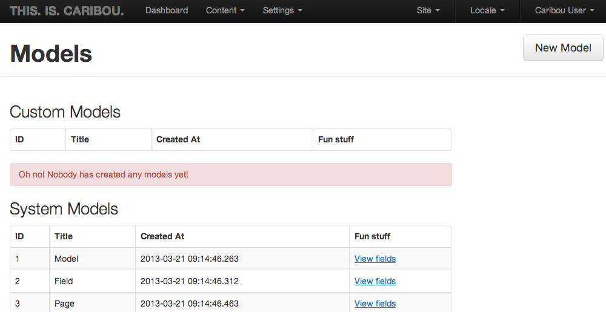

## 4. Create A Model Called "Presentation"

Click the "New Model" button to start creating
your own custom content.  We'll start by creating a model
called *Presentation*.

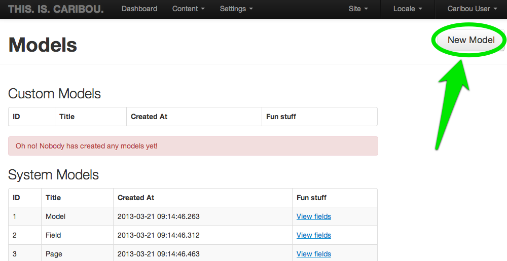
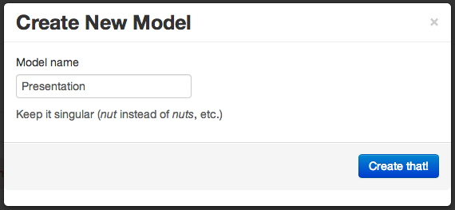

After you've created your model, you'll be shown a page of all of
the fields in your new model.   Initially, the fields will only
be the default set of fields that Caribou uses to maintain your
model, but you can add new fields. 


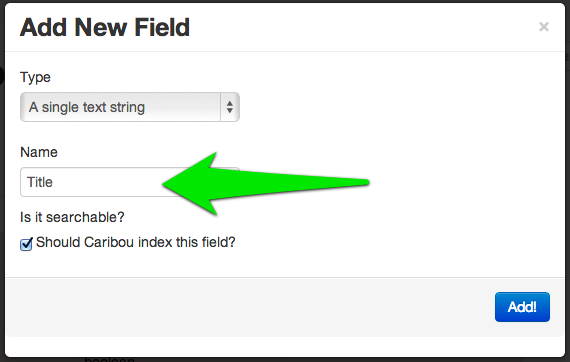

You will start by adding three new
fields:

* A "string" called "Title" (leave "searchable" checked)
* A "string" called "Author" (leave "searchable" checked)
* A "date/time" called "Presentation Date" (uncheck the "searchable" box)

After you've added these three fields, drag the "Title" field to the
top and click "Save" to update the order that the fields appear in your model.

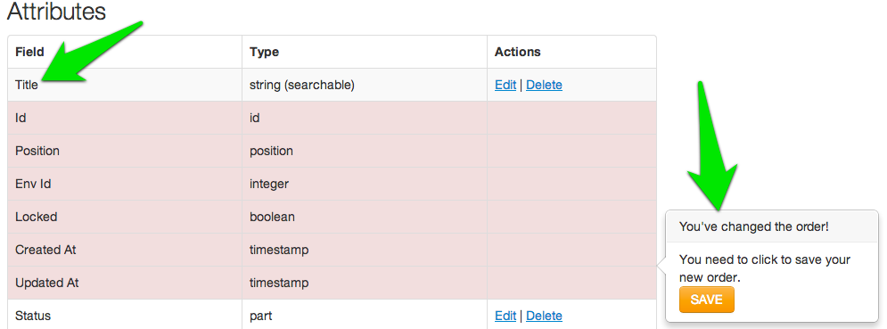

Next you'll create a second model, and then we'll connect them.


## 5. Create A Model Called "Slide"

Return to the *Models* page by clicking the *Models* link in
the breadcrumbs.


Just like you did with *Presentation*, create a new model called *Slide*,
and add three fields (these are slightly different):

* A "string" called "Title"
* A "string" called "Caption"
* An "asset" called "Image"

and once again, drag the title to the top and click "Save".

## 6. Connecting "Presentation" to "Slide"


Go back to the Models page, and click "Tweak fields" for the *Presentation* Model.
You're going to add another fields that will represent a collection of slides that
belong to a presentation.  Click *"+ attribute"* to add another attribute, but this
time set the type "Collection of other model things".  Enter *Slides* for the
name, uncheck the "searchable" checkbox, and choose *Slide* as the Target.

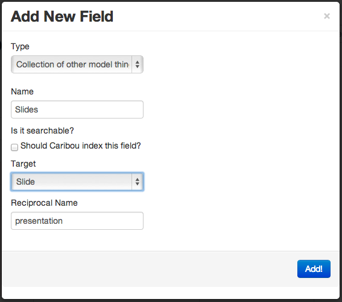

Your presentations all now have a collection of slides, and each slide has an
associated presentation!

## 7. Create Some Content!

From the *Presentation* dropdown at the top, choose "Create New" to make a new
presentation, then click "Save then continue editing".

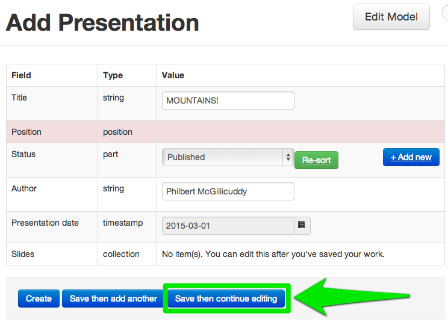

Once you've saved it, you can now add slides to the _slides_ collection.


so click on _Edit_ and you'll move to a screen to add a slide:


As you can see, there are no *Slides* associated with this *Presentation* yet,
so you can click *"+ new"* to create a new *Slide* within this *Presentation*:

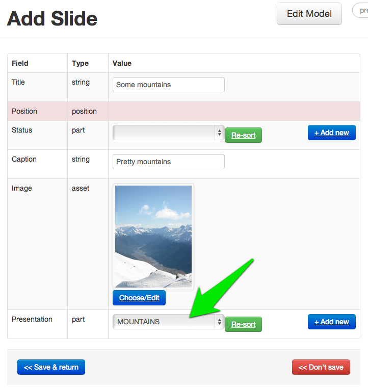

Be sure to upload an image too by clicking on *"Choose/Edit"* and selecting an image.

Go ahead and create a couple more slides, so you end up with something like this:

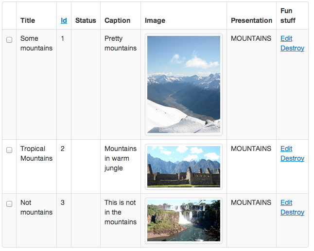


## 8. Make some pages!

(**Note:** at present you need to create pages through the generic admin UI.  This will change soon
when we provide a Page-editor)

Now we're going to create user-facing pages to show our presentations.

Go to the models page, and scroll to *System Models* at the bottom.
Choose *"View fields"* from *Page*, then "Create a Page".   Fill in the fields like this
to create a page that will show a *Presentation*:

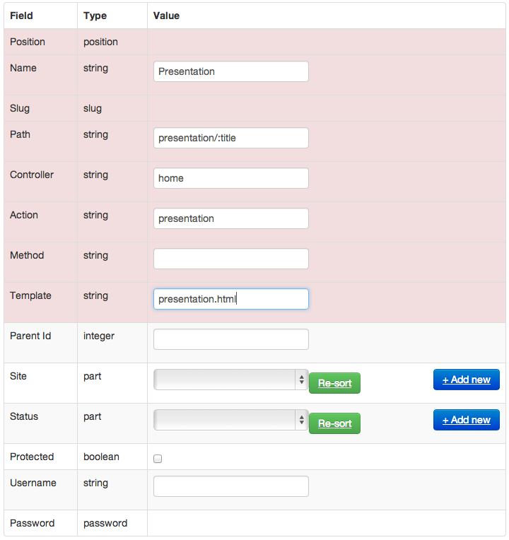

and then create a page to display a slide, again, paying attention to the fields:

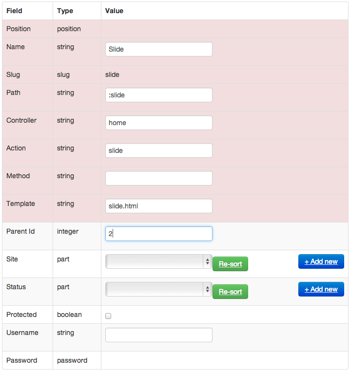

(**Note:** We set the parent id of the *Slide* page to the ID of the newly-created *Presentations* page - this
step will happen automatically in the future).


## 9. Check your pages in the browser!

Navigate to your new *Presentation* page, at [http://localhost:33333/presentation/Mountains]


Oh no!  Your controller action doesn't exist yet.  We need to build it!
Open the file _src/pictograph/controllers/home.clj_ and add the following code:

```clj
(defn presentation
  [request]
  (let [title (-> request :params :title)
        presentation (model/pick
                      :presentation
                      {:where {:title title}
                       :include {:slides {}}})]
    (render (assoc request
              :presentation presentation))))
```


  13. Test page URLs in address bar

Code: Create Page Templates

   1. Create Presentations page

         * Open home controller
         * In home controller, create "presentation" action to pull in
           presentations
         * Create layout.html from template home.html
         * Create presentation.html

              * Fill in body block to display presentations

   2. Create Slide sub-page

         * In home controller, create "slide" action
         * Create "slide.html"

              * Fill in body block to display slides

   3. Run tree to show where those templates are.
   4. Prev/Next links to slides
   5. Reorder Slides in CMS
